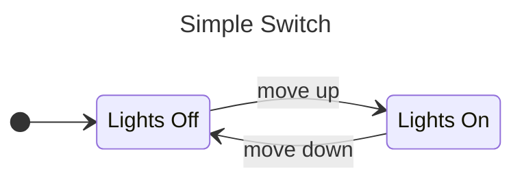
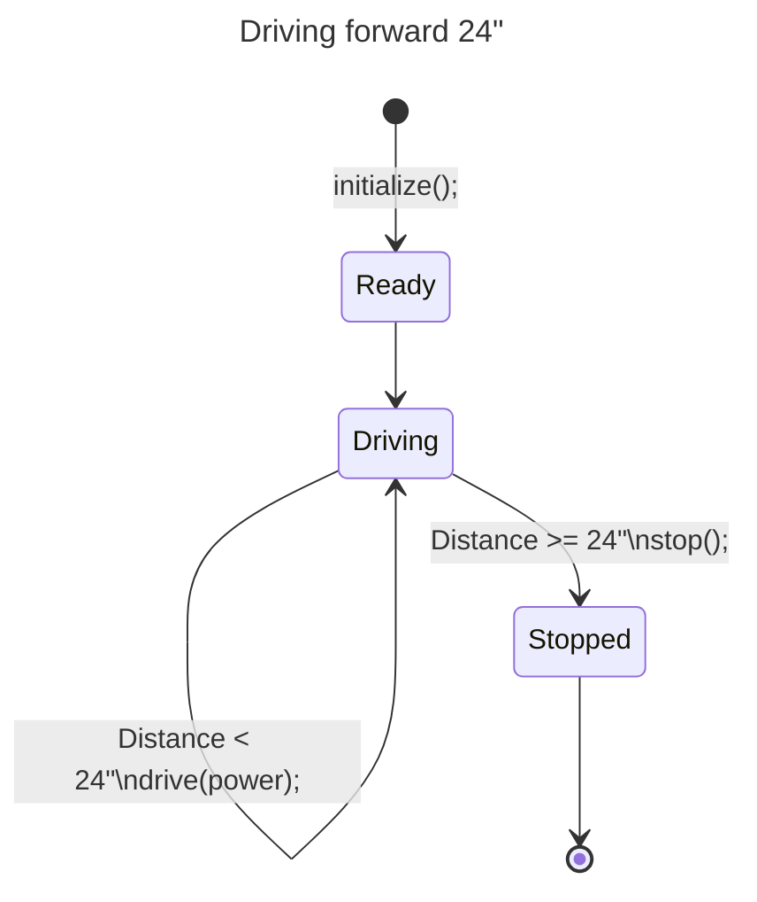

# Programming WPILib on a Romi

## Lesson 1: Clone-ing around
This repo (short for repository) is stored in the [FRCTeam3206 GitHub account](https://github.com/FRCTeam3206). In order to work with it on your own computer, you will need to [clone](https://git-scm.com/docs/git-clone) it. Cloning creates a local copy of the repository on your computer that is linked to the remote repository stored on GitHub. You will be able to edit this local repository in wPILib VSCode.

There are several ways to clone a repo from GitHub. First, open the [RomiTimed23](https://github.com/FRCTeam3206/RomiTimed23) repo on GitHub. Above the code window, there is a green button that says `<>Code` on it. Click on this button to see a menu with several options to clone the repo. The simplest option, if you have [GitHub Desktop](https://desktop.github.com/) installed is to select `Open in GitHub Desktop`. This will create a clone linked to the remote repository. The clone will be located in the "GitHub" directory under "Documents". 

Now that you have cloned this repo, open WPILib VSCode and then open the repository. 
* On the menu bar, click on `File` then `Open Folder ...`, you could also use the keyboard shortcut `Ctrl-K Ctrl-O`.
* Navigate to `Documents\GitHub`
* Click on the folder with this repository
* Click on the `Select Folder` button (this still works if you navigate into the folder

You should now see the contents of this repo on the left side of the VSCode window. Most of the folders and files that you see are there to support the build and deploy process and you won't need to make any changes to them. The robot code will all be stored in:
``` 
src\main\java\frc\robot\
```
Open this directory and you will see several .java files. 
- `Main.java` - This is the "entry point" for the Java program. This file already contains the correct code and you won't need to edit it
- `Robot.java` - The top-level file that defines the behavior of the robot. This is where you'll place the code that controls your robot.
- `RomiDrivetrain.java` - The code that defines the drivetrain and how it operates.

Go ahead and open `Robot.java` and take a look at the code.

----
<div class="page"/>

## Lesson 2: A bit of `git`
*NOTE: If you are using the shared CREATE_XX computer, you are signed in to GitHub with the "RoyalT-Wrecks" account. Please don't sign in with your own account on these computers. If you are working from your own computer, please use your own GitHub account. If you have any trouble using git or GitHub, post a note on the team Discord.*

[`git`](https://git-scm.com/) is a popular version control system (VCS) for managing source code. A VCS provides a solution to the problem of managing code changes when multiple people are contributing to the same code base. It can also make it easier to keep track of changes and correct ones that cause bugs.

In a VCS, all code changes are tracked and can be reverted if they cause problems. `git` does this using the concept of **branches** and **commits**. 

All repositories have at least one branch (called 'main' in this repo). When you want to modify the code, you create a new branch and edit the code in that branch. Once it has been tested, you then merge the new branch back into the main branch. `git` supports having multiple parallel branches, so it is possible to work on several differnt parts of the code base at the same time. A good branch is one that represents a single type of change to the code base, for example a branch to fix a specifc bug or one to add a new feature.

Code changes are added to a branch with a commit. This allows you to specify exactly which changed files are added to the branch and document what has been changed in a given commit. 

### Using `git`

There are several ways to access `git` commands. The command line is the most powerful option, but it can be tricky to remember the correct commands. VSCode has integrated support for `git` and is convenient since you can do things directly in the IDE (integrated development environment). Finally, there is GitHub desktop, which you probably used to clone the interface. The dedicated GUI is easy to use and allows you to do everything you'll need to contribute to the team code repository.

#### Command Line Interface
If you don't already have `git`, you can install it from [git-scm.com](https://git-scm.com/). The WPILib Documentation includes a [Git Version Control Introduction](https://docs.wpilib.org/en/stable/docs/software/basic-programming/git-getting-started.html) that provides a good overview of using the `git` command line from the `git bash` shell.

#### Git and GitHub in VSCode
VS Code has built-in support for managing git repositories, which allows you to conduct the common actions directly fromm the IDE. We also have the GitHub extension installed so that you can create pull requests in the IDE.

#### GitHub Desktop
[GitHub Desktop](https://desktop.github.com/) is a graphical user interface to the most common features of `git`. You can use this to clone repos, make commits, and push and pull code.

### Basic `git` operations
For the next several sections, we'll use the `git` command line interface for the examples. You can do the same things inside VSCode or with the GitHub Desktop by finding the right menus.

#### Making a branch
A branch is an isolated copy of the code. You can make any changes you want within a branch without affecting the code in any other branches. You can have as many branches as you want, but having a lot can get hard to manage. Once you have made and tested your changes, you can `merge` the code from your branch back to the `main` branch to make it part of the robot code. 

Always work on a branch since it isolates your changes and allows mutliple contributors to work on the code simultaneously without overwriting one anothers changes.

If you don't already have it open, load your local repo in WPILib VSCode. Open a terminal from the `Terminal` menu if one isn't already open. If you have installed `git` then you can type the following to create a new branch:

``` pwsh
git checkout -b "your-branch-name"
```
This command both creates and checks-out (makes active) the new branch. Branch names should be short and descriptive. The name can't contain spaces, so it is common to use dashes between words for readability. 

The branch you create will be based on whatever code is in your current working directory. If you make edits to the code, then create a new branch, your edits will be available in your new branch. 

You can see which branch you are on by typing:
```pwsh
git branch
```
This will display a list of all local branches with an asterisk (*) by the current branch.

If you want to change to a different branch, you can use:
```pwsh
git checkout "branch-to-checkout"
```
Make sure that you've committed any changes you want to keep before changing branches.

#### committing code to a branch
Now that you are on your own branch go ahead and edit `Robot.java`. For exammple, add a comment with your name at the top of the file and save the file. To store this change in the repo, you need to `commit` it to the repo. There are two steps to making a commit, staging the files and then making the commit. 

First you indicate which files you want to update by `add`ing them to the stage (list of files that will be committed):
```pwsh
git add Robot.java
```
To add all files that have been changed, type:
```pwsh
git add .
```

Second, you `commit` them to the repo:
```pwsh
git commit -m "Short description of the change"
```
The `-m` tells `git commit` to add the text following it as the description of the commit. Good comments a short and help people understand what was changed. Instead of saying "fixed stuff", explain what you fixed, such as "corrected motor ids". You don't have to describe the exact code, since people can see how the code changed when they look at the commit, instead, try to describe why you made the change.

#### Push code to the remote (GitHub)
Finally, we need to add this to the `GitHub` repository. The first time you `push` a branch to the upstream repository, you need to tell it that you want to add the branch to that repo.
```pwsh
git push -u origin "your-branch-name"
```
After that, you'll be able to update the branch any time you make a new commit by just typing:
```pwsh
git push
```
Whenever you start working on code, you should update the local repo from the remote repe. This will make sure that you are always working from the latest version of the code from GitHub. The opposite of pushing code to the repo is pulling it from the repo:
```pwsh
git pull
```

If there is a branch on GitHub that you want to work on, but it isn't on the computer you are currently on, you can crete a local tracking branch with:
```pwsh
git fetch
git checkout "name-of-remote-branch"
```

#### Merging code from another branch
The primary way that you get code from one branch into another is with the `merge` command. 
``` pwsh
git checkout "destination-branch"
git merge "source-branch"
```
`git` will try to integrate the new code into the current branch automatically, but that isn't always possible. If it can't figure out how to do the merge because there are conflicting edits, it will let you know that there has been a merge conflict. Managing and correcting merge conflicts is an advanced topic that we won't cover here.

### The takeaway
The more frequently you use git, the more benefit you will get from it. Pull from the remote when you start working on code, make branches for the work you are doing, create frequent commits to capture specific, granular changes. Finally, don't be afraid to ask for help.

----
<div class="page"/>

## Lesson 3: Driving Lessons - Basic Teleop
The driver-controlled portion of the match is called `telop`. During this part of the game, the driver is primarily in control of the robot and commands are relayed from controllers attached to the drive station to the robot through the FMS (field managemnt system). Typically, the drive team consists of a driver, a mechanism operator, and a drive coach. 

### Inputs
The primary way that the drive and mechanism operator control the robot is via a [joystick or controller](https://docs.wpilib.org/en/stable/docs/software/basic-programming/joystick.html). Let's add a controller to the program so that we can operate the Romi.

> **JAVA Concept: `import`**
>
> Java and WPILib provide a lot of classes that you can use in your programs, but they aren't avaiable by default in your code. In order to access them, you have to `import` them into the `namespace` of your program. You do this by using the `import` statement followed by the path to the class that you want to import. You must import classes into any file that needs them. Typically, `import` statements are located at the top of a `.java` file, just after the `package` statement. 

> **NOTE**
> Before making any changes to your code, create a new branch.

The first step is to `import` the class so that we can interact with the controller. The class that we're going to use it the [`XboxController`](https://github.wpilib.org/allwpilib/docs/release/java/edu/wpi/first/wpilibj/XboxController.html) class, which works with the Logitech controllers set to 'X' mode. It's located in `edu.wpi.first.wpilibj`. Add this line after the other imports at the top of the `Robot.java` file:

``` java
import edu.wpi.first.wpilibj.XboxController;
```
The next step is to create a new instance of the `XboxController` class. First, we have to define a variable that will hold the reference to the controller instance. We only want to have one reference to the joystick that we will re-use whenever we need to read values from the joystick. We'll do this inside the `Robot()` class before the constructor so that it is available to all the methods in the class. 

Find the line that instantiates the `RomiDrivetrain()`:
``` java
  private final RomiDrivetrain m_drivetrain = new RomiDrivetrain();
```
and add this line after it:
``` java
  private XboxController m_controller = new XboxController(0);
  (1)---- (2)----------- (3)--------- (4)--------------------
```
This line defines a member variable and initializes it to a new instance of the XboxController class. The individual parts of this statement do the following:
1. `private` is an optional keyword that says this variable can only be accessed within this class. This prevents other classes from reading or altering our controller.
2. `XboxController` defines the `type` of the variable. Every variable must have a specific `type` in Java, which specifies what type of object it can hold.
3. `m_controller` is the name of the variable. This is how our code will access the instance.
4. `= new XboxController(0)` creates a new instance by calling the constructor of the `XboxController` class and assigns it to the variable. In this case, we pass the constructor the value 0, which indicates that the controller will be connected to channel 0 of the driver station.

Finally, we need to connect the values we read from the controller with the inputs to the drivetrain. This should be done in the `teleopPeriodic()` method of the `Robot` class. This method is automatically called once every 20 ms when the robot is in `teleop` mode. Any code you put in here will run 50 times/second, so this is the place for the code you will use to operate the robot in `teleop`. 

Scroll down in the code until you see the definition of `teleopPeriodic()`. Currently this method does nothing. There is no code between the curly brackets `{` and `}`. Update the method to include the line between the curly brackets:

```java
    m_drivetrain.arcadeDrive(m_controller.getLeftY(), m_controller.getRightX());
```
Once you've done this, `teleopPeriodic()` should look like:

``` java
  @Override
  public void teleopPeriodic() {
    m_drivetrain.arcadeDrive(m_controller.getLeftY(), m_controller.getRightX());
  }
```
### Test the code
Now you're ready to test the code. 

First, power on the Romi and connect to it's WiFi access point. You should also plug in an XboxController into your computer for controlling the Romi.

You start the simulation by clicking on the WPILib icon above the code window and selecting `WPILib: Simulate Robot Code`. This will compile your code and let you know if there are any errors. If the code compiles, then it will open a `dashboard` called `glass` that shows you information about the robot status.


> **WIP**
>
>outputs: motor configuration, drivetrains
>
>inputs: joystick, buttons
>
>driver station & dashboard
>
>telemetry: sending data to dashboards (don't use print!)


----
<div class="page"/>

## Lesson 4: Roaming Romi - Basic Autonomous
### State Machines
Every match starts with a period of time, typically 15 seconds, during which the robot can score points autonomously, often called auton. During auton the robot must move and act on its own without recieving any input from the operators. To be successful in auton, you'll want to be able to use sensors to provide feedback about the robots current **state** and then use this information to make decisions about what the robot should do next.

In engineering, this type of system is often described as a [**state machine**](https://en.wikipedia.org/wiki/Finite-state_machine). 

A light switch is an example of a state machine. The switch has two states, "on" and "off" and clearly defined transitions between those states. This can be represented with a state diagram like:


A [state diagram](https://en.wikipedia.org/wiki/State_diagram) helps you keep track of what states a system can be in and what causes it to move from one state to another. Each state is represented by a box and each transition is an arrow leading from one box to another.

When the robot is operating autonomously, it will need some form of feedback to "know" when to transistion from one state to the next. This feedback could come from a timer running on the robot, a sensor measuring the internal state (such as the wheel encoders or a gyroscope), or a sensor detecting an external stimulus (such as a color sensor detecting a game piece or a camera measuring the position of an April Tag). 

Let's try some simple auton examples on the Romi.

### Driving a certain distance
You can use the encoders on your Romi wheels to measure how far the robot has traveled. This provides the feedback needed to write an auton that has the robot drive forward a certain distance. The state diagram for this is:



This state diagram demonstrates three phases common to every autonomous command. These phases are initialize, execute, and end.

The **initialize phase** happens once at the start of an autonomous command. During this phase, you should configure any subsystems that you'll use and capture any state variables that you need to track. This makes sure that the robot is **ready** to carry out the autonomous step. In the example above, this happens in the `initialize();` which occurs immediately after the start of the autonomous step and transitions the robot to the `Ready` state. 

The **execute phase** runs continuously during the active autonomous command. This phase is when the robot 'does' what it is supposed to during the command. During this phase you should send commands to motors, actute servos and pnuematic cylinders, and monitor sensors for feedback. In the example, this phase begins as soon as the robot is `Ready`. As long as the robot hasn't reached the target distance, power is applied to the motors and the robot is in the `Driving` state. From this state, there are two transitions. If the `Distance < 24"` then it applies power to the wheels to stay in the `Driving` state. If `Distance >= 24"`, then it should stop the motors and transition to the `Stopped` state.

The **end phase** provides a chance to "clean up" and make sure that the subsytems are in the correct state before the autonomous command exits. This is a place to set motors to the correct state and reset sensors. In the example, this state begins with the `At Target` transition and involves stopping the motors. After this, the robot enters the `Stopped` state and then the autonomous command exits.

In many cases, an autonomous command won't need to do something in all of the phases. For example, you may may only need to change the state of a servo, which can be done with a single command in the `initialize` phase without any `execute` phase. Even when you don't need all the phases, it's good practice to think through all the phases for each autonomous command.

Now that we have a state diagram we can translate that into code. 

First, for convenience, let's add a method that reports the average distance driven by averaging the distance driven by the two wheels. Add the following method to `RomiDrivetrain()`:

``` java
  public double getAverageDistanceInch() {
    return (getLeftDistanceInch() + getRightDistanceInch())/2;
  }
```

In `Robot()` we need a member variable to track which state we're in. A simple option is to use an integer to indicate which step is active. We can call this `autoState` and initialize it to 1 to represent the first state that it will enter. While we're adding member variables, we should also add one that represents the target distance we want to drive. You can add these two variables after the other variables at the top of the `Robot()` class definition:

``` java
  private static final double TARGET_DISTANCE = 24;  // inches
  private int autoState = 1;
```

The autonomous routine can be handled by creating a new method in `Robot()` that defines the steps. Lets call this method `defaultAuto()`. This autonomous command will have to issue the correct commands to the robot depending on the value of the `autoState` variable. It will also have to decide when to move to the next state and update the value of `autoState` accordingly. We could use a long `if (autoState == 1) {} else if (autoState == 2) {} ...` block, but the Java `switch` block provides a clearer way of handling this type of flow control, so we'll use that instead. 

> **JAVA Concept: `switch` and `case`**
>
> The Java `switch()` block allows the program to branch based on the value of a variable or return from a method call. Each value is represented by a `case` statement followed by the code that should run for that value.

In `Robot()` after the `autonomousPeriodic()` method, create a new method called `defaultAuto()` and add a `switch` block:

``` java
private void defaultAuto() {
  switch(autoState) {

  }
}
```
The next step is to add the cases that we want to handle. The first case is when `autoState` has a value of `1`. This corresponds to our `initialize` phase. We can reset the encoders to zero them to make it easy to know how far we've traveled from the starting point. To do this, place this code inside the `switch` block:

``` java
    case 1:  // initialize
      m_drivetrain.resetEncoders();
      autoState++;
      break;
```

The `case 1:` statement indicates where the execution will start if `autoState` has a value of `1`. A call to `m_drivetrain.resetEncoders();` sets them to 0 so that we are ready to start. Since we've done everything we needed to do in this step, we increment the value of `autoState` using the `++` (increment) operator, to indicate that we are transitioning to the next state. The increment operator is a shorter way of writing `autoState = autoState + 1`. So now, `autoState` has a value of `2`. Finally, the `break` statement tells Java to skip all remaining lines in the `switch` block.

With the `initialize` phase done, we now want to enter the `execute` phase and start driving forward. Following the `break` statement at the end of `case 1:` add `case 2:`

``` java
    case 2:  // execute (drive to target)
      m_drivetrain.arcadeDrive(0.5, 0);
      if (m_drivetrain.getAverageDistanceInch() >= TARGET_DISTANCE) {
        autoState++;
      }
      break;
```

This tells the robot to move forward at `0.5` power. It then checks to see how far the robot has traveled by checking the encoders. If it's gone far enough, then we move to the next state by incrementing `autoState`.

Finally, we need to tell the robot that we want to stop moving once we've reached our desitination:


``` java
    case 3:  // end
      m_drivetrain.arcadeDrive(0, 0);
      autoState++;
      break;
```

Finally, we should have a case that covers the situation when no other state is active. For now, we could call it `case 4:` however Java `switch` blocks have a `default:` case that will run whenever no other case matches. This offers the benefit that it will also handle a situation when `autoState` isn't set to a valid value.

``` java
    default:  // done
      m_drivetrain.arcadeDrive(0, 0);  // feed the watchdog
      break;
```

You'll notice that we still call `m_drivetrain.arcadeDrive(0,0)`. This makes sure that the motors are definitely stopped, and it also keeps the watchdog happy. 

> **WPILib Concept: the watchdog**
>
> The watchdog is a safety feature on the RoboRIO that makes sure that the motors are being updated regularly by the code. If the code were to crash, the motors might be left in a powered state without any control. The watchdog monitors how long it has been since the motors were sent a command and disabled the motors if it has been too long (by default 100 ms). Sending a command to the motors every cycle "feeds" the watchdog and keeps it happy.

You should now have a `defaultAuto()` method that looks like:

``` java
private void defaultAuto() {
  switch(autoState) {
    case 1:  // initialize
      m_drivetrain.resetEncoders();
      autoState++;
      break;
    case 2:  // execute (drive to target)
      m_drivetrain.arcadeDrive(0.5, 0);
      if (m_drivetrain.getAverageDistanceInch() >= TARGET_DISTANCE) {
        autoState++;
      }
      break;
    case 3:  // end
      m_drivetrain.arcadeDrive(0, 0);
      autoState++;
      break;
    default:  // done
      m_drivetrain.arcadeDrive(0, 0);  // feed the watchdog
      break;
  }
}
```

We can run this method when Autonomous is enabled by adding a call to it in `autonomousPeriodic()`. When you look at `autonomousPeriodic()` you'll notice that it also uses a `switch` block. This is done to allow the drive team to select different autonomous routines from the dashboard. We can add the call to the `default:` case so that `autonomousPeriodic()` now looks like:

``` java
/** This function is called periodically during autonomous. */
@Override
public void autonomousPeriodic() {
  switch (m_autoSelected) {
    case kCustomAuto:
      // Put custom auto code here
      break;
    case kDefaultAuto:
    default:
      defaultAuto();
      break;
  }
}
```

You can now connect to a Romi and test this code.